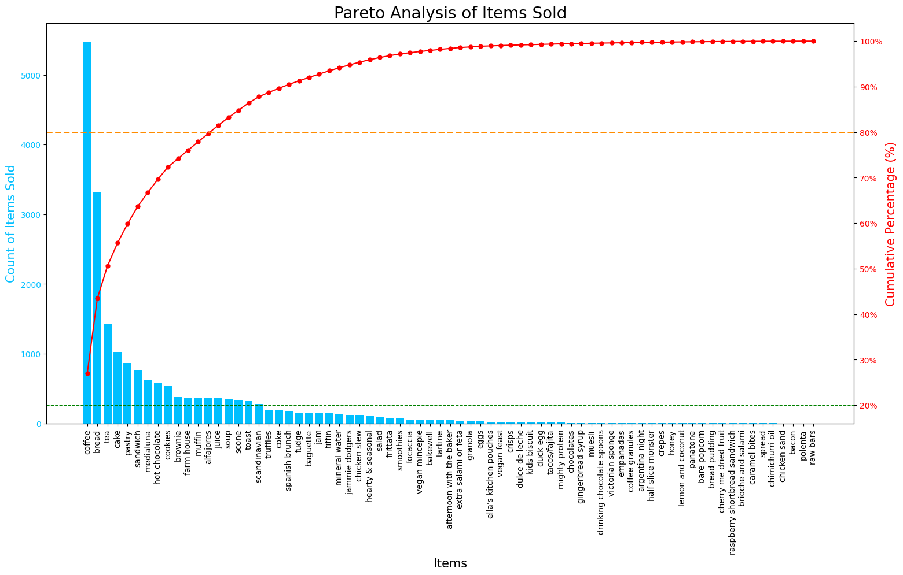

# Bakery Data Mining & Recommendation Engine


**An end-to-end data mining project on bakery sales data. Uncovers customer insights, performs market basket analysis (Apriori), and builds a collaborative filtering (SVD) recommendation engine to increase cross-selling.**

---

## 🎯 Project Overview

This project is a comprehensive, end-to-end data science journey that transforms raw sales data from "The Bread Basket" bakery into a powerful business intelligence and recommendation system. The primary goal is to leverage data mining techniques to uncover actionable insights that can drive strategic decisions, optimize marketing efforts, and ultimately boost sales through personalized recommendations.

The project is structured into three main phases:
1.  **Strategic EDA & Foundation:** Cleaning the data and performing high-level analyses to understand the business landscape.
2.  **Customer & Product Modeling:** Diving deep into customer behavior and product relationships using machine learning.
3.  **Simulation & Prediction:** Building and deploying a functional recommendation engine to provide real-time, personalized suggestions.

---

## 💡 Results & Key Insights

This analysis yielded several actionable business insights:

1.  **The Power of Coffee:** Coffee is the undisputed king of sales and the central hub for cross-selling. The Apriori analysis revealed a very strong association rule: **(Toast) -> (Coffee)** with a confidence of over 70%. **Business Action:** Train staff to always suggest coffee with toast, or create a "Toast & Coffee" morning combo deal.

2.  **Weekend Rush is Real:** The sales heatmap confirmed that the bakery's "golden hours" are between 11 AM and 2 PM on weekends. **Business Action:** Ensure maximum staffing and inventory for core products (Coffee, Bread, Cake) during these peak times to maximize revenue and customer satisfaction.

3.  **Personalization is Key:** The SVD-based recommendation engine successfully generated personalized suggestions. For a sample transaction, it recommended items like 'Sandwich' and 'Fudge', demonstrating its ability to move beyond generic "best-seller" recommendations and cater to individual tastes. **Business Action:** Integrate this logic into an online ordering system or a POS system to empower staff with data-driven upselling suggestions.

---

## 🛠️ Key Analyses & Features

This project implements a wide range of data mining and machine learning techniques:

*   **Strategic Exploratory Data Analysis (EDA):**
    - **Pareto Analysis (80/20 Rule):** Identified the vital few products (like Coffee and Bread) that generate ~80% of sales, guiding focus for inventory and marketing.
    - **Peak Hours Heatmap:** Visualized the "golden hours" of the bakery (weekend afternoons), providing critical insights for staffing and time-based promotions.

*   **Customer Segmentation:**
    - **K-Means Clustering:** Segmented customers into four distinct behavioral groups (e.g., "Weekday Morning Grab-and-Go" vs. "Weekend Afternoon Social"), enabling targeted marketing strategies.
    - **VIP Customer Analysis:** Identified the most valuable customers and analyzed their unique purchasing preferences.

*   **Market Basket Analysis:**
    - **Apriori Algorithm:** Uncovered strong associations between products, revealing that items like 'Cake', 'Pastry', and 'Toast' are frequently purchased with 'Coffee'.
    - **Network Graph Visualization:** Created a powerful visual map of product relationships, highlighting 'Coffee' as the central hub in the bakery's sales network.

*   **Recommendation Engine:**
    - **Collaborative Filtering (SVD):** Built a robust recommendation model to predict which items a customer is likely to buy next based on their transaction history.
    - **Personalized Recommendations:** The engine can generate a top-5 list of recommended items for any given transaction, creating a direct tool for cross-selling.

---

## 📊 Key Visualizations

| Pareto Analysis (80/20 Rule) | Peak Hours Heatmap |
| :---: | :---: |
|  |  |

| Product Association Network | VIP Customer Preferences |
| :---: | :---: |
|  |  |

---

## 🚀 How to Use

To run this project locally, please follow these steps:

1.  **Clone the repository:**
    ```bash
    git clone https://github.com/AyaatMohammed/bakery-data-mining-and-recommendation-engine.git
    ```
    

2.  **Navigate into the project directory:**
    ```bash
    cd bakery-data-mining-and-recommendation-engine
    ```

3.  **Install the required libraries:**
    ```bash
    pip install -r requirements.txt
    ```

4.  **Download the data:**
    - Go to the [Kaggle Dataset Page](https://www.kaggle.com/datasets/akashdeepkuila/bakery ).
    - Download the `Bakery.csv` file.
    - Create a `data` folder in the project's root directory and place the `Bakery.csv` file inside it.

5.  **Run the notebook:**
    - Open and run the `notebooks/bakery_analysis_and_modeling.ipynb` notebook in a Jupyter environment (like Jupyter Lab or VS Code).

---

## 📁 Project Structure

```
bakery-data-mining-and-recommendation-engine/
│
├── 📂 notebooks/
│   └── 🔬 01_Data_Analysis_and_Modeling.ipynb
│
├── 📂 images/
│   ├── 📊 pareto_analysis.png
│   ├── 📈 peak_hours_heatmap.png
│   ├── 🌐 product_association_network.png
│   └── 🏆 vip_customers_preferences.png
│
├── 📜 .gitignore
│
├── 📜 README.md
│
└── 📜 requirements.txt
```
